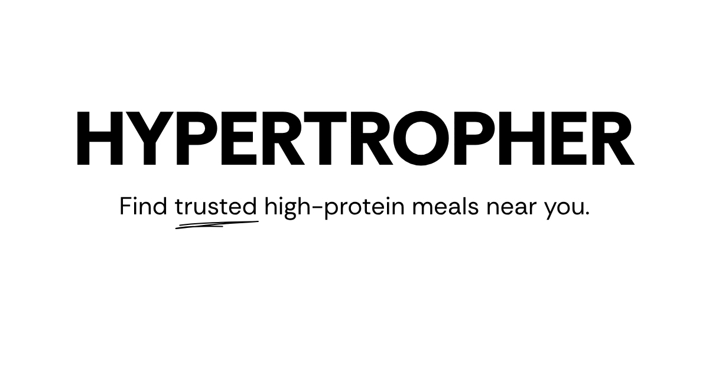

## Hypertropher



Hypertropher is a private, invite-only web app for serious gym-goers who rely on outside food and want a **trusted, shared database of high‑protein dishes**.  
Instead of wasting money on trial‑and‑error meals, friends log dishes they've actually tried (with ratings, photos, and comments) so everyone can quickly find reliable, high‑protein options in their city.

### Who it’s for
- People who train regularly and care about protein intake.
- People who mostly eat from restaurants / delivery apps and don’t want to cook every meal.
- People who want to share their trusted dishes with their friends.

### What it does
- **Dish discovery**
  - Browse high‑protein dishes by city.
  - Filter by protein source (Chicken, Fish, Paneer, etc.).
  - Sort by price and distance (nearest vs. whole city).
- **Dish contribution**
  - Add in‑store or online dishes with:
    - Restaurant (Google Maps search or cloud kitchen entry).
    - Price, protein source, and three ratings: Protein Content, Taste, Overall Satisfaction.
    - Photo upload with automatic client‑side compression.
    - Optional comment for context (e.g., portion size, spice level).
- **Personal tracking**
  - `My Dishes` – all dishes you’ve contributed.
  - `My Wishlist` – dishes you want to try later.
- **City‑aware experience**
  - Global city selection using Google Places API.
  - All lists (Discover, My Dishes, My Wishlist) are filtered by the user’s current city.

### Key Features (MVP)
- Invite‑only email/OTP authentication.
- Restaurant‑centric schema (dishes link to shared restaurant records).
- Region‑based delivery app availability (apps filtered by country).
- Text‑only display of available delivery apps on each dish card.
- Reporting system to flag delivery apps that no longer serve a restaurant.
- Mobile‑first UI with bottom navigation and smooth page transitions.

### Tech Stack
- **Frontend:** Next.js 14 (App Router), React, TypeScript.
- **UI:** Shadcn UI, Tailwind CSS.
- **Backend & DB:** Supabase (PostgreSQL, Auth, Storage).
- **Maps:** Google Maps Places API for restaurant & city search.
- **Deployment:** Vercel (recommended).

### Running locally

```bash
# install dependencies
npm install

# start dev server
npm run dev

# app will be available at:
http://localhost:3000
```

You’ll need a Supabase project and Google Maps API key configured via environment variables (see `Docs/Supabase_Workflow.md` and `DATABASE_SCHEMA.md` for schema and setup details).
